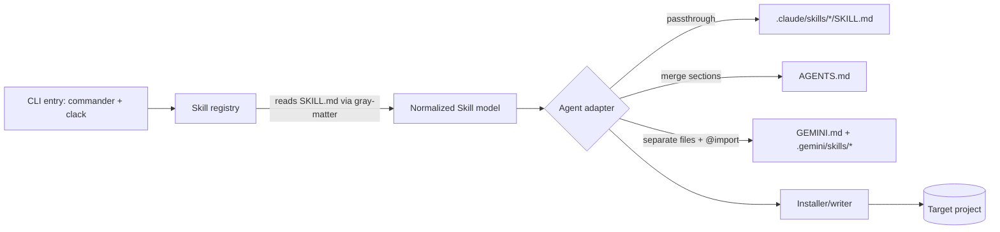

# Architecture · Status: Draft

## Overview — components and responsibilities
- **CLI entrypoint** (`bin`) — parses args (`commander`); if interactive, runs the wizard (`@clack/prompts`).
- **Skill registry** — discovers the bundled source skills, reads each `SKILL.md` (frontmatter + body) via `gray-matter`, exposes a normalized `Skill` model.
- **Translation layer** — one **adapter per agent**. Takes the normalized skills + target dir, emits files in that agent's native format. This is the heart of the project and the only part that knows agent-specific quirks.
- **Installer/writer** — resolves target paths, handles existing-file collisions (skip/overwrite/merge), writes files, prints a post-install summary.
- **Source skills** — the four skills vendored into the package as the source of truth.

## Diagram

## Tech stack
- **Language:** TypeScript on Node — types matter for parsing/transforming markdown; clean npm distribution.
- **Prompts:** `@clack/prompts` — multiselect UX for "pick agent, tick skills."
- **Arg parsing:** `commander` — non-interactive `--agent/--skills/--yes` path.
- **Skill parsing:** `gray-matter` — split `SKILL.md` frontmatter from body.
- **Build:** `tsup` — zero-config bundle of a single CLI binary.
- **Tests:** `vitest` — translation logic is highly unit-testable.

## Data model — key entities & relationships
- **`Skill`** — `{ name, description, frontmatter: Record<string,unknown>, body: string, assets?: string[] }`. Normalized from a source `SKILL.md`.
- **`Agent`** — `{ id: 'claude'|'codex'|'gemini', label, adapter }`.
- **`Adapter`** — `translate(skills: Skill[], ctx: InstallContext) => FileOutput[]`.
- **`FileOutput`** — `{ path, contents, mode: 'create'|'overwrite'|'merge' }`.
- **`InstallContext`** — `{ targetDir, selectedSkills, conflictPolicy }`.

## Agent translation strategies *(the core decisions)*
- **Claude Code — passthrough.** Copy each skill to `.claude/skills/<name>/SKILL.md` verbatim. On-demand triggering preserved. ✅ full fidelity.
- **Codex — merge.** Codex reads a single monolithic `AGENTS.md` per directory (no named/on-demand skills). Emit/append one clearly-delimited `## Skill: <name>` section per selected skill into `AGENTS.md`, between managed markers so re-runs update cleanly. Triggering becomes "always-on guidance" — flagged to the user.
- **Gemini — import.** Gemini concatenates `GEMINI.md` hierarchically and supports `@file.md` imports. Write each skill to `.gemini/skills/<name>.md` and add `@./.gemini/skills/<name>.md` lines to `GEMINI.md`. Keeps files modular but always-on; no on-demand triggering.

## Key decisions & tradeoffs
- **Adapter-per-agent** · isolates volatile, agent-specific format logic · costs some duplication, but each convention can be updated independently.
- **Managed markers for merge targets** (`<!-- le-restaurant:start/end -->`) · makes `AGENTS.md`/`GEMINI.md` edits idempotent and re-runnable · we must never clobber user content outside the markers.
- **Accept fidelity loss** on Codex/Gemini (always-on, no triggering) rather than fake a skill system · honest and shippable · users lose auto-invocation on those agents.
- **Vendor source skills into the package** · single source of truth, works offline · needs a sync step/check against `.claude/skills/`.

## Cross-cutting
- **Errors:** never partially trash a file — write atomically, back up merge targets, clear messaging on conflicts.
- **Idempotency:** re-running the installer updates managed sections, doesn't duplicate them.
- **Testing:** golden-file tests per adapter (input skills → expected output files).
- **Observability:** none beyond a clear post-install summary; no telemetry.

## External integrations
- npm registry (publish/distribution only). No runtime services.

← [Home](./Home.md)
