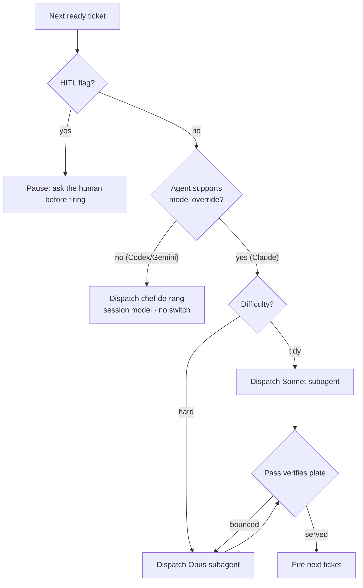
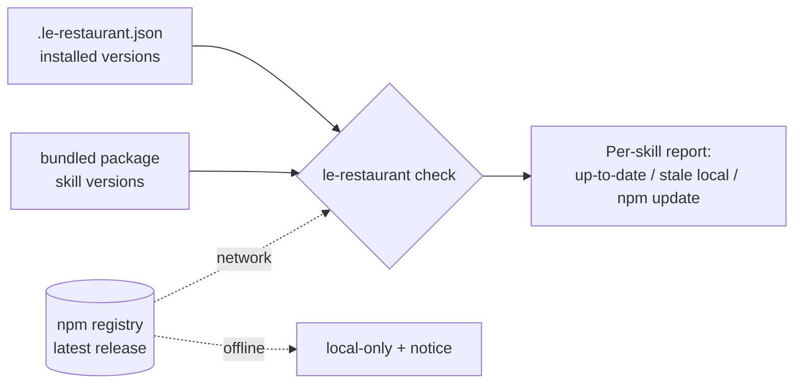

# Architecture · Status: Draft

## Overview — components and responsibilities

The brigade has **no runtime dispatcher**. Each skill is markdown; "send a chef-de-rang," "pick a model," "pause for a human" are *instructions the host model follows*. The installer (`src/adapters`) translates the skill markdown into each agent's native format. So a behavior is only real on an agent whose format can *express* it — the central constraint of this whole change.

Two subsystems:

### Subsystem 1 — Model-Aware Dispatch (mostly markdown + one adapter change)
- **mise-en-place (author):** writes `Difficulty` + `HITL` tags into `Phases.md` / `Development-Plan.md` per feature, by a deterministic rubric. The only stage that reasons about intrinsic complexity before tickets exist.
- **maître-d (enforcer):** at seating, copies the tag onto each ticket (like it already copies `Done when` / `Touches`). At fire-time: selects the model, or pauses for HITL, and escalates Sonnet→Opus when a plate bounces at the pass.
- **chef-de-rang (worker):** dispatched as a model-pinned **subagent**; its "ticket is my whole memory" design already fits an isolated context.
- **Claude adapter:** newly emits `.claude/agents/chef-de-rang.md` with `model: sonnet`, generated from the skill body — so the Maître D' can dispatch a real subagent and override to Opus per ticket via the per-call model param (which takes precedence over the frontmatter default).
- **Codex / Gemini adapters:** model-selection is a documented no-op (same degradation pattern they already use for on-demand triggering). HITL guidance survives as plain instruction.

### Subsystem 2 — Skill Versioning & Staleness (frontmatter + parsing + adapters + new CLI command)
- **Source of truth:** `version: x.y.z` per skill in `SKILL.md` frontmatter, bumped when that skill changes.
- **Parse:** `gray-matter` already reads frontmatter; surface `version` as a typed field on `Skill`.
- **Stamp + manifest:** on install, the writer emits a uniform `.le-restaurant.json` manifest in the target recording each installed skill's version + the package version. Uniform across agents so `check` reads one place regardless of how skills were rendered.
- **`check` command:** reads the manifest, compares against (a) the bundled package's skill versions = **local drift**, and (b) the newest le-restaurant on the **npm registry** = **update available**. Offline → local-only with a notice.

## Diagram — dispatch decision at fire-time


## Diagram — version staleness check


## Tech stack
- **Language/runtime:** TypeScript/Node — *unchanged*.
- **CLI:** `commander` (add a `check` subcommand) + `@clack/prompts` for any interactive output — *existing deps*.
- **Frontmatter:** `gray-matter` — *existing*, already parses arbitrary keys.
- **npm lookup:** plain `fetch` against the registry JSON (`https://registry.npmjs.org/le-restaurant/latest`) — *no new dependency*.
- **Build/test:** `tsup` / `vitest` — *unchanged*.

## Data model — key entities & relationships
- **`Skill`** (`src/types.ts`) gains `version: string` (semver), parsed from frontmatter (falls back to `0.0.0` / warns if absent).
- **Install manifest** `.le-restaurant.json` in the target:
  ```jsonc
  {
    "package": "1.4.0",            // le-restaurant version that installed
    "agent": "claude",             // which adapter ran
    "installedAt": "2026-06-25",
    "skills": { "chef-de-rang": "1.2.0", "maitre-d": "1.1.0", ... }
  }
  ```
- **Order ticket** gains copied-down fields: `Difficulty: tidy|hard`, `HITL: yes|no` (markdown, not code).
- **Agent definition** `.claude/agents/chef-de-rang.md`: frontmatter `name`, `description`, `model: sonnet`, `tools`; body = chef-de-rang skill body.

## Key decisions & tradeoffs
- **Bundle two features in one plan** · shared surfaces (frontmatter, adapters, sync) · gives up clean single-purpose history; mitigated by independent phases.
- **Model selection is Claude-Code-only** · only its format expresses subagent + model override · Codex/Gemini users get HITL but no cost win — accepted, matches existing degradation.
- **Uniform manifest over per-format version reads** · one parser for `check` instead of three · one extra emitted file per install.
- **`check` reports, never mutates** · safe, predictable · user re-runs the installer to update.
- **Compare against both local + npm** · catches both "package moved on" and "package itself is old" · pulls a network call into `check` (degraded offline).

## Cross-cutting — auth, errors, observability, testing
- **Sync:** every canonical `skills/` edit must be mirrored to `.claude/skills/` so `scripts/check-skills-sync.ts` passes — treat as part of every skill-editing task's Done-when.
- **Errors:** `check` must not throw on network failure — catch, fall back to local-only, exit 0 with a notice.
- **Testing:** `vitest` — unit tests for version/tag parsing, manifest write/read, adapter stamping & agent-def emission; the npm lookup is mocked (no live network in tests).
- **Backward compat:** a skill or install with no `version` / no manifest must degrade (treated as unknown/`0.0.0`), never crash `check`.

## External integrations
- **npm registry** (read-only, `GET /<pkg>/latest`) for the remote freshness half of `check`. Optional at runtime; offline-safe.

← [Home](./Home.md)
